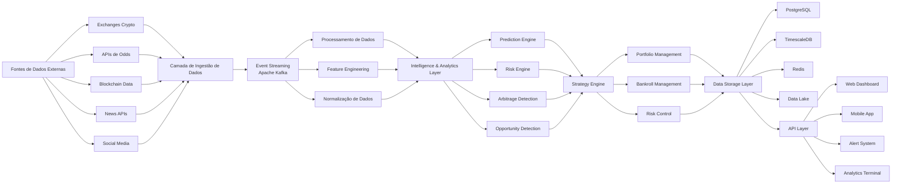
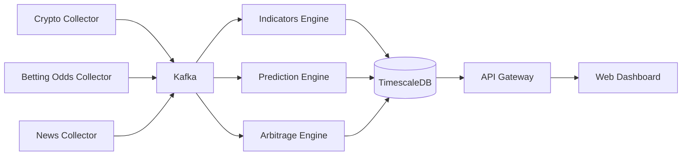

# Financial Intelligence Platform (FIP)

A **Financial Intelligence Platform (FIP)** é uma plataforma avançada orientada a dados para **coleta, processamento e análise de informações financeiras em tempo real**, com foco em dois grandes domínios:

* **Crypto Intelligence**
* **Betting Intelligence**

O objetivo da plataforma é transformar **grandes volumes de dados de mercado em insights acionáveis**, auxiliando traders, analistas e pesquisadores quantitativos a tomar decisões mais informadas.

A arquitetura foi projetada seguindo princípios **cloud-native**, utilizando microserviços, streaming de eventos e pipelines de dados escaláveis.

---

# Visão do Projeto

A visão de longo prazo da FIP é construir um **terminal de inteligência financeira**, inspirado em ferramentas profissionais utilizadas por:

* fundos quantitativos
* hedge funds
* analistas de mercado
* syndicates de apostas esportivas
* traders de criptomoedas

A plataforma integra:

* ingestão massiva de dados
* analytics avançado
* modelos de inteligência artificial
* análise de estratégias
* gestão de risco e capital

---

# Domínios Principais

## Crypto Intelligence

Módulo focado na análise do mercado de criptomoedas.

Principais funcionalidades:

* coleta de dados de exchanges
* indicadores técnicos
* monitoramento de whales
* análise de liquidações
* detecção de arbitragem
* análise de volatilidade
* análise de sentimento de mercado
* modelos de previsão de preço

---

## Betting Intelligence

Módulo focado na análise estatística de apostas esportivas.

Principais funcionalidades:

* ingestão de odds de casas de apostas
* coleta de estatísticas esportivas
* modelos de previsão de resultados
* detecção de **value bets**
* análise de ineficiência de mercado
* gestão de bankroll
* acompanhamento de performance

---

# Arquitetura Geral

A plataforma segue uma arquitetura baseada em camadas, permitindo **alta escalabilidade e processamento em tempo real**.

```text
Fontes de Dados Externas
        ↓
Camada de Ingestão de Dados
        ↓
Streaming de Eventos (Kafka)
        ↓
Processamento e Analytics
        ↓
Camada de Inteligência e IA
        ↓
Motor de Estratégias
        ↓
Camada de Decisão / Execução
        ↓
Armazenamento de Dados
        ↓
API
        ↓
Aplicações (Dashboard / Apps)
```

---
## Arquitetura da Plataforma

A **Financial Intelligence Platform** segue uma arquitetura baseada em ingestão massiva de dados, processamento em streaming e motores de inteligência analítica.



---

# Stack Tecnológica

## Backend

* Java (Spring Boot)
* Python (analytics e pipelines de dados)

## Frontend

* React
* Next.js
* TailwindCSS

## Infraestrutura de Dados

* PostgreSQL
* TimescaleDB (dados temporais)
* Redis (cache)
* ClickHouse (analytics de alto desempenho)

## Streaming de Eventos

* Apache Kafka

## Processamento de Dados

* Python
* Pandas
* Polars
* Apache Spark / Flink (futuro)

## Machine Learning

* Scikit-learn
* XGBoost
* PyTorch

## Infraestrutura

* Docker
* Kubernetes (futuro)
* CI/CD

---

# Estrutura do Repositório

```text
fip/

backend/
    api-gateway
    core-services

analytics/
    crypto
    betting

collectors/
    crypto
    betting

frontend/
    dashboard

infra/
    docker
    scripts
```

---

# Pipeline de Dados (Exemplo)

Um fluxo simplificado de dados do módulo de criptomoedas:

```text
API de Exchange
        ↓
Serviço Collector
        ↓
Kafka (streaming de eventos)
        ↓
Serviços de Analytics
        ↓
Banco de Dados
        ↓
API
        ↓
Dashboard Web
```

---

# Primeiro Microserviço

O primeiro serviço desenvolvido na plataforma é o **Crypto Market Collector**.

Esse serviço conecta-se aos feeds de mercado de exchanges e coleta dados em tempo real.

Responsabilidades:

* conectar em WebSockets das exchanges
* receber dados de mercado
* publicar eventos no Kafka
* salvar histórico no banco de dados

---

# Ambiente de Desenvolvimento

O projeto inclui um ambiente local baseado em Docker.

Serviços disponíveis:

* PostgreSQL / TimescaleDB
* Redis
* Kafka
* Zookeeper
* PgAdmin

Para iniciar o ambiente:

```bash
cd infra/docker
docker compose up -d
```

Acessar o PgAdmin:

```
http://localhost:5050
```

---

# Roadmap do Projeto

## Fase 1 — Fundação de Dados

* collectors de dados crypto
* modelagem inicial do banco
* streaming de eventos
* primeiros indicadores

## Fase 2 — Inteligência de Mercado

* indicadores técnicos
* monitoramento de whales
* análise de liquidações
* dashboards de mercado

## Fase 3 — Betting Intelligence

* ingestão de odds
* modelos estatísticos
* detecção de value bets

## Fase 4 — Inteligência Artificial

* previsão de preços
* previsão de resultados esportivos
* detecção de oportunidades

## Fase 5 — Plataforma SaaS

* arquitetura multi-tenant
* gestão de usuários
* planos de assinatura
* APIs públicas

---

# Objetivos Futuros

A meta de longo prazo é evoluir a FIP para uma **plataforma SaaS de inteligência financeira**, oferecendo:

* analytics avançado
* insights automatizados
* ferramentas de análise de estratégias
* APIs para pesquisa quantitativa

---

# Contribuição

O projeto está em fase inicial de desenvolvimento.

Contribuições futuras podem incluir:

* novos collectors de dados
* modelos de analytics
* modelos de machine learning
* dashboards
* melhorias de infraestrutura

---

# Licença

A licença do projeto será definida nas próximas fases de desenvolvimento.

---

# Autor

Projeto criado como uma **plataforma pessoal de pesquisa em inteligência financeira e análise quantitativa**.
